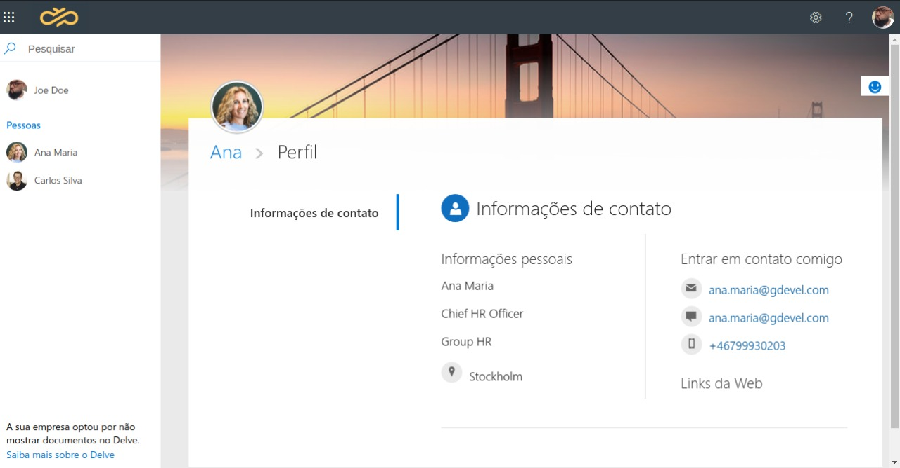
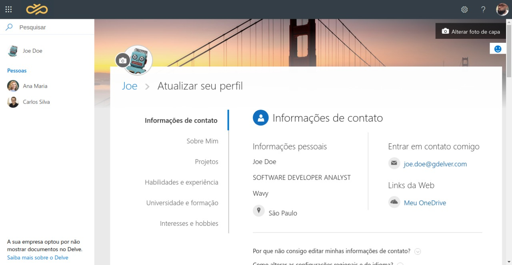
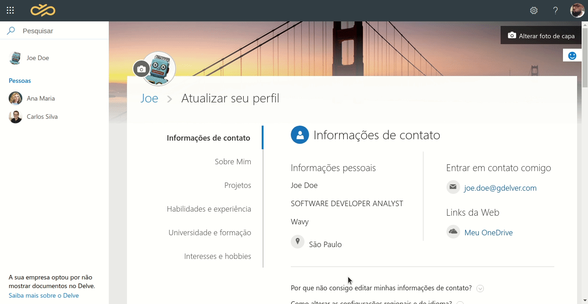

## {DE}code Frontend to Empower

 > Programa de mentoria para pessoas que atuam como front-end

## Objetivo: 
Estamos na reta final para você fazer parte da nossa tripulação, você já concluiu duas etapas. :heart_eyes: :trophy:	

- [x] Etapa: Processo de seleção de pessoas desenvolvedoras.  *done*
- [x] Etapa: Processo de seleção avaliando sua expertise técnica. *done*
- [ ] Etapa: Processo avaliativo desafio técnico e teórico. *to-do*
- [ ] Etapa: Feedback People to DEcode to Empower. *to-do* 

Agora, iremos avaliar como você lida no seu dia a dia com desafios que podem surgir durante o desenvolvimento de funcionalidades.

## Tecnologias

Abaixo listamos as principais tecnologias que deverão ser analisadas durante o seu desafio, sinta-se livre para sugerir novas tecnologias ou bibliotecas que julgar necessário para o desenvolvimento do desafio.

- Vue
- Vuetify
- Vuex  
- TypeScript 
- Testes Unitários: Vue-Test-Utils e Jest
- Testes de Integração: Cypress

## Desafio: 

O desafio se complementa em duas etapas sendo uma parte teórica e uma parte prática, o nosso objetivo com esse desafio é avaliar como você evolui o desenvolvimento de uma "mini-app" validando casos de uso comum e alternativo e como se desenvolve em torno das tecnologias citadas no tópico citado. Vamos lá!?

### Resumo:

O DelveApp se trata de um webApp similar ao linkedin, só que ao invés dele conectar pessoas de forma pública ele é para as empresas internas. Mais informações a respeito do [Delve](https://support.microsoft.com/pt-br/office/o-que-%C3%A9-o-delve-1315665a-c6af-4409-a28d-49f8916878ca).

Uma visão geral de como é o Delve pode ser vista na imagem abaixo:

É comum em todas as aplicações web, termos uma área de usuário onde ele pode visualizar suas informações como:
- Nome
- E-mail 
- Telefone
- Endereço
- Foto

Pode ocorrer de ter mais informações que a aplicação julga necessária para que o usuário insira. Com base nisso, precisamos elaborar uma página de perfil para visualizar essas informações e outra para editar essas informações, levando em consideração algumas diretrizes de User Interface do Delve.

### Desafio Técnico:

> Na rota da página visualizar perfil:

1. Precisamos desenvolver um layout de duas colunas, onde temos:
 - Sidebar: Foto, Nome, Cargo, Cidade/Estado
 - Content: Cards de informações para visualização e edição.

 

> Na rota da página edição de perfil:

2. Precisamos fornecer condições para que seja atualizado as informações do usuário para que seja exibida no Sidebar, para o carregamento inicial pode exibir informações randômicas com o uso da API [RandomUser](https://randomuser.me/)

3. Precismos fornecer condições para que seja atualizado seu endereço, para isso podemos adotar as informações da API [Postmon](https://postmon.com.br/)

4. Para fazermos upload da foto do usuário podemos adotar a API do [Cloudinary](https://cloudinary.com/documentation/vue_image_and_video_upload);

5. Layout do perfil possui as seguintes sessões para edição:

- Informações de contato
- Sobre Mim
- Projetos
- Habilidades e experiência
- Universidade e formação
- Interesses e hobbie

Abaixo segue um gif para ver o comportamento de cada section de inclusão do perfil.

## Conclusão:

Nosso projeto basicamente lida com duas rotas:

- /user 
- /user/edit 

Para que possamos fazer a estrutura do layout de 2 colunas, pode ser adotado:

- flex-box
- css-grid
- float

Para que possamos fazer o consumos das API's listada, podemos usar um httpClient famoso que se trata do [axios](https://github.com/axios/axios), basicamente iremos fazer utilizar metodo http `get` para buscar as informações e o método `post` para submeter os dados que julgar necessário.

Quando o usuário clicar em salvar as informações elas precisam ser instanciadas em algum local para que possam ser visualizadas, por exemplo:

- LocalStorage | [referência](https://developer.mozilla.org/pt-BR/docs/Web/API/Window/localStorage)
- JsonServer | [referência](https://www.npmjs.com/package/json-server)
- Firebase | [referência](https://firebase.google.com/?hl=pt-br)

